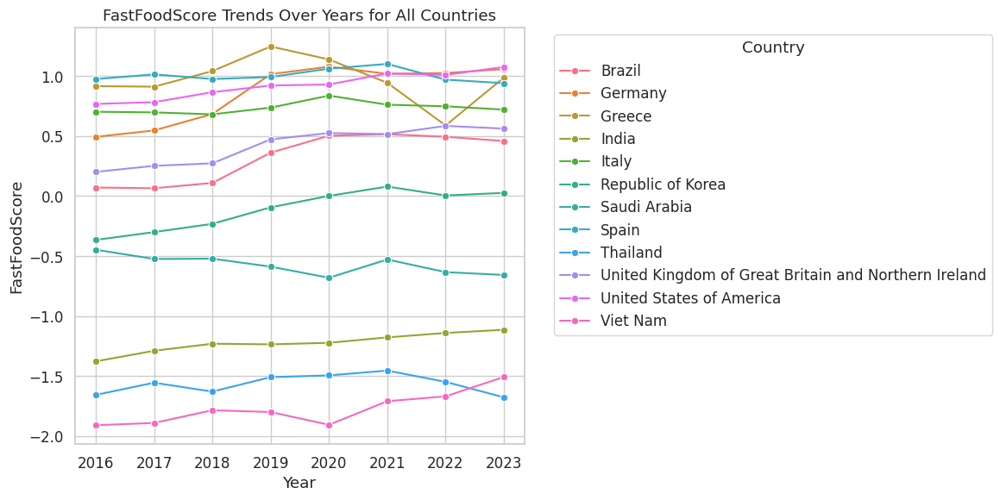
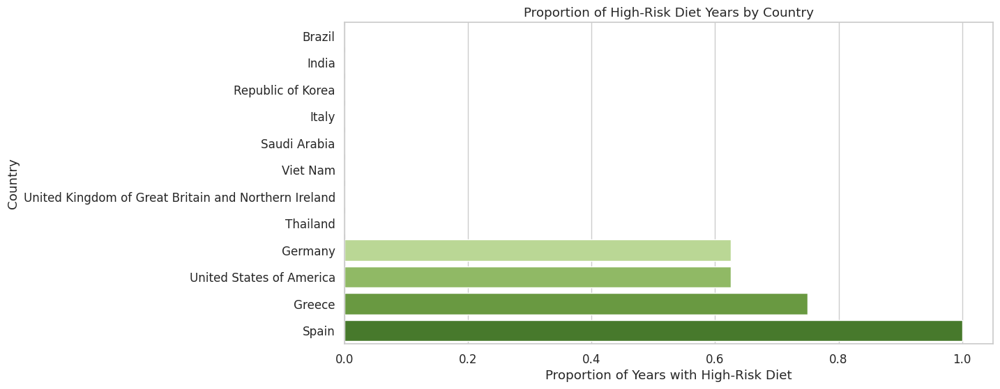
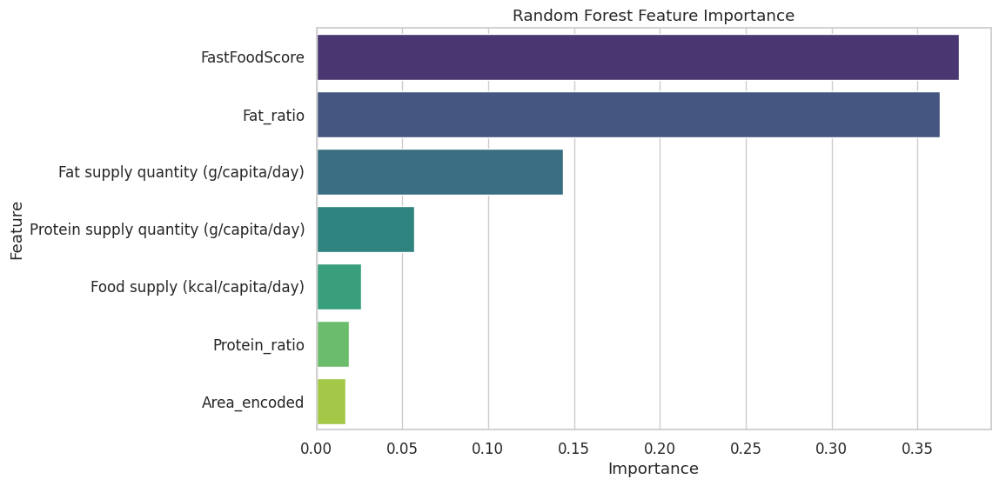

# High-Risk Diet Prediction

**Which countries have fat-heavy, "fast-food-style" diets, and is that getting worse?** An end-to-end
data-science pipeline on FAO Food Balance Sheets: cleaning, feature engineering, exploratory analysis,
three classifiers with stratified cross-validation, and SHAP interpretation.

Final project for DATA602 (University of Maryland), by **Simran Kharbanda**.

📓 **[Read the full notebook as a web page](https://sim2200.github.io/Final-Project-DATA602/)** ·
[Open in Colab](https://colab.research.google.com/github/Sim2200/Final-Project-DATA602/blob/main/DATA602_Final_Project.ipynb)

| FastFoodScore over time | Share of high-risk years per country |
|---|---|
|  |  |

## Data

[FAOSTAT Food Balance Sheets](https://www.fao.org/faostat/en/#data/FBS), 2016–2023, for 12 countries
(Brazil, Germany, Greece, India, Italy, Republic of Korea, Saudi Arabia, Spain, Thailand, United Kingdom,
United States, Viet Nam). The raw download has 4,476 rows, one per country × food item × year × nutrient,
with three nutrients: food supply (kcal/capita/day), protein supply and fat supply (g/capita/day).

## Pipeline

1. **Clean and reshape.** Median imputation per nutrient, pivot to one row per country-item-year, then
   aggregate over food items to get total calories, protein and fat per country-year (96 rows).
2. **Feature engineering.** `Protein_ratio` and `Fat_ratio` (grams per kcal, so countries with different
   total calorie supply are comparable), a `FastFoodScore` based on the fat share, and label encoding
   of the country. Numeric features are standardized and values beyond 3 standard deviations removed.
3. **Target.** `HighRiskDiet = 1` for the top quartile of `FastFoodScore` (24 of 96 country-years); a
   three-way `DietCategory` (Healthy / Moderate / Unhealthy) is used for the exploratory plots.
4. **Exploratory analysis.** Macronutrient distributions, correlation heatmap, box plots by risk group,
   country-level trends over the eight years, protein-vs-fat scatter by diet category.
5. **Models.** Random Forest, Logistic Regression and XGBoost on an 80/20 stratified split, plus
   5-fold stratified cross-validation; confusion matrices, ROC curves, feature importance and SHAP.

## What the analysis shows

- **Fat share of calories is the story.** Spain, Greece, Germany and the United States sit in the
  high-risk quartile for most or all of the eight years; India, Thailand and Viet Nam never do.
- **Diets are shifting.** Brazil's and the Republic of Korea's scores rise steadily from 2016 to 2023;
  most European countries are flat at a high level.
- **Feature importance and SHAP agree:** `FastFoodScore` and `Fat_ratio` carry almost all of the signal,
  absolute fat supply comes next, and country identity adds little once the ratios are known.



| Model | Test accuracy (n = 20) | 5-fold CV accuracy |
|---|---|---|
| Random Forest | 1.00 | 0.973 ± 0.033 |
| Logistic Regression | 0.95 | 0.867 ± 0.073 |
| XGBoost | 1.00 | 0.987 ± 0.027 |

## An honest note on the accuracy numbers

Those scores should not be read as predictive power. The label is *defined* as the top quartile of
`FastFoodScore`, and `FastFoodScore` (and `Fat_ratio`, which it is built from) are also model inputs, so
the classifiers are mostly rediscovering a threshold on a feature. That is why the tree models reach 100%
and why the ratio features dominate the importance plots. The dataset is also small: 96 country-years
from 12 countries, with 20 test rows.

The value of the project is the pipeline and the exploratory findings, not the classifier. Making the
prediction task meaningful is the first item below.

## Next steps

- Define the target from an **outcome** that is not a feature: obesity, diabetes or cardiovascular
  prevalence from WHO/GBD data, so the model has something real to predict.
- Add sugar, fibre and sodium supply and a processed-food measure; cover more countries and years.
- Treat it as a time series (forecast next year's score) rather than independent country-years, and
  evaluate with grouped cross-validation by country.

## Repository

```
DATA602_Final_Project.ipynb   the full tutorial-style notebook (Colab)
index.html                    the notebook rendered as a page, served at sim2200.github.io/Final-Project-DATA602
figures/                      three figures exported from the notebook for this README
```

Python, pandas, scikit-learn, XGBoost, SHAP, seaborn/matplotlib. The FAOSTAT CSV is downloaded from the
link above and uploaded in the notebook's first cell.

## References

- Willett et al. (2019). *Food in the Anthropocene: the EAT–Lancet Commission on healthy diets from sustainable food systems.* The Lancet. https://doi.org/10.1016/S0140-6736(18)31788-4
- Schwingshackl & Hoffmann (2015). *Dietary patterns and risk of mortality.* Clinical Nutrition. https://doi.org/10.1016/j.clnu.2014.09.021
- Hu (2002). *Dietary pattern analysis: a new direction in nutritional epidemiology.* Current Opinion in Lipidology.
- WHO (2023). *Healthy diet* fact sheet. https://www.who.int/news-room/fact-sheets/detail/healthy-diet
